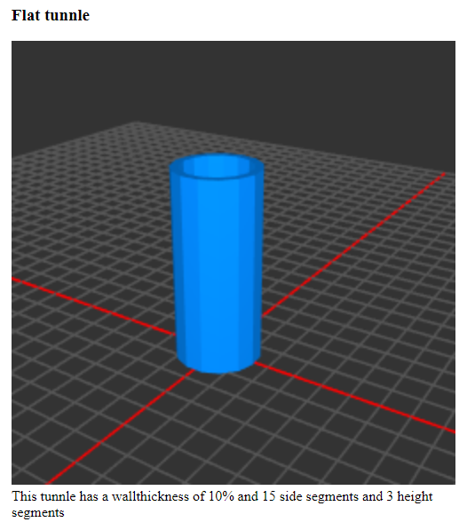

# tunnlejs
An JS library for creating cool configurable and 3d-printable tunnles in STL-Format.

# Description
This library should be used to create very cool tunnles with a minimum of configuration needed.

The first version of this library will use a 1-dimensional array which configures the tunnles outside line,
a parameter for the tickness and the length of the tunnle.

After that there will be two 1-dimensional arrays for defining an inner and an outer wall. To enable for
example a flat outer surface and a curvy inner surface.

After that there will follow an array of 3-dimensional vector-coordinates which will define the tunnles
form. For example to make a torus or a curved pipe 

The next version will make it possible to connect standardized attachments at the tunnle ends to connect them
to future devices or buildings.
For example will cities of the future be 3-dimensional, which means, that they will be interconnected between
multiple levels of their height. For this reason there will be a need for standardized connections.
Tunnles will also be very important on the moon to connect the different settlements with 3d-printed tunnles.

# Screenshots

# ToDo
[x] Flat pipe

[x] Inside and outside wall definable

[ ] Define pipes shape

[ ] Connection elements

